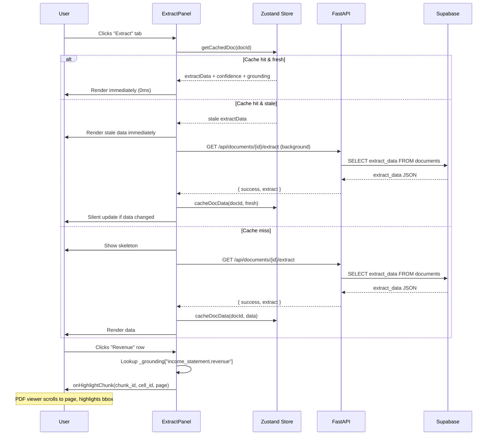
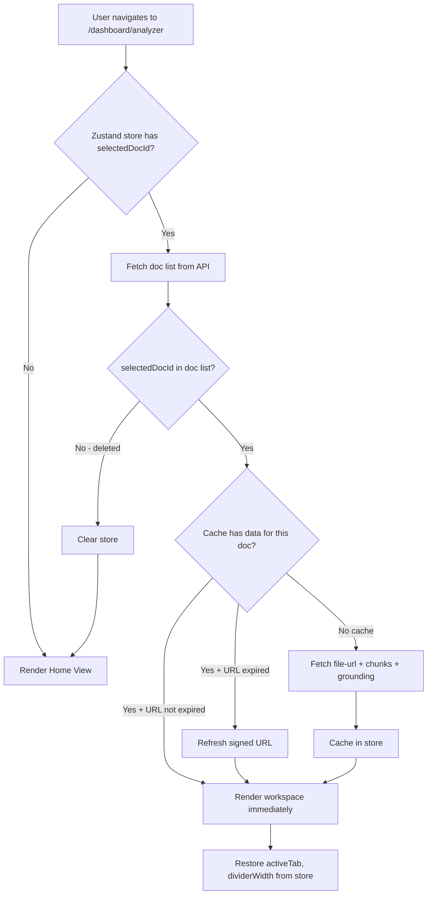
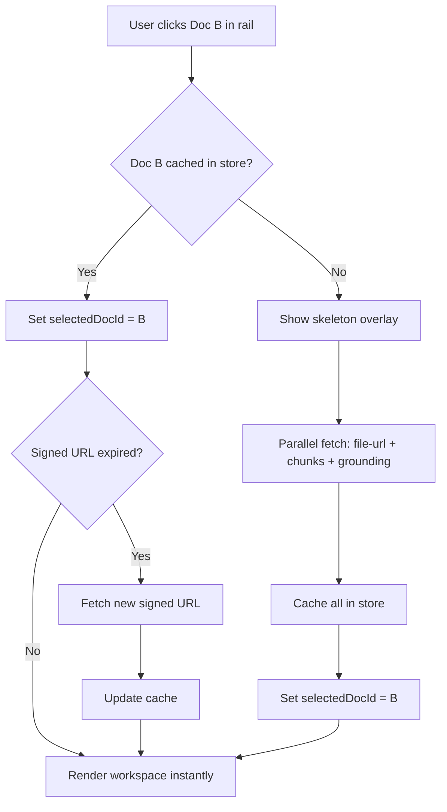

# Extract Section Design + Analyzer State & Performance

> **Status:** DRAFT — Pending Review
> **Author:** AI Lead Architect
> **Date:** 2026-03-25
> **Scope:** Extract tab redesign, analyzer session persistence, tab/doc switch performance

---

## 1. Executive Summary

This document addresses three interconnected problems in the Alpha Lens Analyzer:

1. **Extract tab is functional but shallow** — it shows flat key/value rows from `extract_data` with no grounding, no confidence, no raw JSON, and no connection to the PDF viewer. It's the weakest of the three tabs.
2. **State loss on navigation** — leaving the Analyzer (e.g., to FinBot or Reports) and returning resets everything: selected document, active tab, scroll positions, panel widths, loaded data. Users must re-select and re-load.
3. **Slow tab/doc switching** — ExtractPanel refetches on every tab activation. Document switching makes 3 parallel API calls with no caching. Users see loading skeletons repeatedly for data that hasn't changed.

The design below provides concrete, implementation-ready solutions for all three, aligned with the existing Next.js 14 / FastAPI / Supabase / Landing.AI ADE architecture.

---

## 2. Current Pain Points

### 2.1 Extract Tab Limitations

| Problem | Impact |
|---------|--------|
| No confidence scores per field | Users can't judge extraction reliability |
| No field-level grounding | Extracted values feel disconnected from source — can't click to see where a number came from |
| No grounding link to PDF | Extract values feel disconnected from the source document — unlike Parse and Chat tabs which both highlight regions on the PDF |
| No section-level collapse/expand | Long documents produce a wall of cards with no hierarchy control |
| Refetches on every tab switch | 200-500ms flash of skeleton on every Parse→Extract→Parse cycle |
| No export | Users can't download extracted data as CSV/JSON |

### 2.2 Analyzer State Loss

| Scenario | What Happens | Expected |
|----------|-------------|----------|
| Open doc → navigate to FinBot → return to Analyzer | Resets to pre-upload home view | Should restore workspace with same doc, tab, scroll |
| Open doc → browser refresh | Same reset | Should restore last session |
| Switch between two docs rapidly | Full re-fetch each time, no warmup | Second switch should be near-instant from cache |

**Root cause:** All state lives in React `useState` inside `page.tsx`. No persistence layer. Navigation unmounts the component, destroying all state.

### 2.3 Performance Bottlenecks

| Operation | Current Latency | Target |
|-----------|----------------|--------|
| Tab switch (Parse↔Extract↔Chat) | 200-500ms (refetch + skeleton) | < 50ms (cached, instant swap) |
| Document switch | 800-1500ms (3 API calls) | < 300ms (prefetch + cache) |
| Return to Analyzer from another section | 1000-2000ms (full reload) | < 200ms (restore from store) |
| First document open after upload | 1000-2000ms | 800ms (acceptable — cold start) |

---

## 3. Target UX for Extract Section

### 3.1 Information Architecture

The Extract tab is reorganized into a **summary header + collapsible statement cards + footer actions**:

```
┌─────────────────────────────────────────────────────┐
│  📊 Document Summary Bar                            │
│  ┌──────────┬──────────┬──────────┬──────────────┐  │
│  │ Company  │ FY 2023  │ USD      │ 🟢 Clean     │  │
│  │ XYZ Inc  │ Annual   │          │ Audit Opinion│  │
│  └──────────┴──────────┴──────────┴──────────────┘  │
├─────────────────────────────────────────────────────┤
│                                                     │
│  ▼ Income Statement                    [6 fields]   │
│  ┌─────────────────────────────────────────────────┐│
│  │ Revenue              $142.5M    ██████████  95% ││
│  │ Gross Profit         $89.2M     █████████   88% ││
│  │ Operating Income     $34.1M     ████████    82% ││
│  │ Net Income           $28.7M     ████████    80% ││
│  │ EBITDA               $45.3M     █████████   90% ││
│  │ EPS                  $2.34      ██████      65% ││
│  └─────────────────────────────────────────────────┘│
│                                                     │
│  ▶ Balance Sheet                       [7 fields]   │
│  ▶ Cash Flow                           [5 fields]   │
│                                                     │
│  ▼ Key Metrics                         [7 fields]   │
│  ┌─────────────────────────────────────────────────┐│
│  │ Gross Margin         62.6%     ████████████ 95% ││
│  │ Net Margin           20.1%     █████████    88% ││
│  │ ...                                             ││
│  └─────────────────────────────────────────────────┘│
│                                                     │
│  ▼ Audit & Red Flags                                │
│  ┌─────────────────────────────────────────────────┐│
│  │ 🟢 Unqualified / Clean                         ││
│  │ ⚠ Revenue recognition timing mismatch          ││
│  │ ⚠ Related party transactions above threshold   ││
│  └─────────────────────────────────────────────────┘│
│                                                     │
├─────────────────────────────────────────────────────┤
│  [⬇ Export JSON]  [⬇ Export CSV]                    │
└─────────────────────────────────────────────────────┘
```

### 3.2 Key UX Decisions

**a) Confidence bars per field**

Each extracted value shows a micro confidence bar (thin colored bar, 40px wide) next to the value. Confidence comes from ADE's extraction confidence when available, falling back to a heuristic (field present + non-null = high, null = N/A).

- 90-100%: green `#059669`
- 70-89%: amber `#f59e0b`
- < 70%: red `#dc2626`
- N/A: gray `#94a3b8`

**b) Collapsible sections**

Each statement card (Income, Balance, Cash Flow, Metrics, Audit) is collapsible. Default: first two expanded, rest collapsed. State persisted in analyzer session store.

**c) Summary bar (sticky)**

Sticky at top of Extract scroll area. Shows company name, fiscal year, period, currency, and audit opinion badge at a glance. Always visible even when scrolled deep into a section.

**d) No separate JSON view in Extract**

The Parse tab already provides Markdown and JSON sub-tabs showing the full parsed document structure (chunks, grounding, bounding boxes). The `jsonformodlanding.ai.md` reference file confirms this is the correct location for raw JSON inspection. The Extract tab is purely a **structured summary view** — users who want raw JSON go to Parse → JSON.

**e) PDF grounding on field click**

When user clicks an extracted value row (e.g., "Revenue $142.5M"), the PDF viewer highlights the region where that value was found. This requires mapping extract fields back to grounding cells.

**Implementation approach:** During extraction in the worker, we annotate each field with the `chunk_id` + `cell_id` (if from a table) where the value was sourced. This is stored as `_grounding` metadata alongside the extract data. On click, the frontend resolves the grounding ID to a bbox and highlights it — same mechanism as Chat tab citations.

**f) Export actions**

- **Export JSON**: Downloads `extract_data` as `{company}_{fiscal_year}_extract.json`
- **Export CSV**: Flattens the nested schema into rows: `[Section, Field, Value, Confidence]`

### 3.3 UX States

| State | Visual |
|-------|--------|
| **Loading** | Skeleton cards (3 sections), pulsing rows — same as current but with section headers visible |
| **Empty** | Centered illustration + "No extract data available" + "This document hasn't been processed for extraction yet." |
| **Partial** | Available sections shown, missing sections show a muted "Not found in document" row |
| **Error** | Red banner at top with error message + Retry button. Previous cached data (if any) still shown below. |
| **Success** | Full card layout with summary bar |

---

## 4. Detailed Technical Architecture

### 4.1 Enhanced Extract Data Model

**Backend change** — extend the `extract_data` stored in Supabase `documents` table:

```python
# Current extract_data structure (flat values only):
{
  "company_name": "XYZ Inc",
  "income_statement": { "revenue": 142500000, ... },
  ...
}

# Enhanced structure (with confidence + grounding):
{
  "company_name": "XYZ Inc",
  "income_statement": {
    "revenue": 142500000,
    "gross_profit": 89200000,
    ...
  },
  "_confidence": {
    "income_statement.revenue": 0.95,
    "income_statement.gross_profit": 0.88,
    "balance_sheet.total_assets": 0.92,
    ...
  },
  "_grounding": {
    "income_statement.revenue": { "chunk_id": "uuid-1", "cell_id": "0-8", "page": 0 },
    "income_statement.gross_profit": { "chunk_id": "uuid-1", "cell_id": "0-a", "page": 0 },
    ...
  }
}
```

The `_confidence` and `_grounding` keys are populated by the worker during `extract()` processing. They are optional and backward-compatible — existing documents without these keys render normally (confidence bars hidden, click-to-highlight disabled).

### 4.2 Worker Enhancement (`worker.py`)

After `extract()` returns the schema, the worker:
1. Iterates each extracted field value
2. Searches parsed chunks for the closest text match (exact number match or fuzzy label match)
3. Records `chunk_id`, `cell_id`, and `page` in `_grounding`
4. If ADE provides per-field confidence (from the schema extraction), stores it in `_confidence`
5. Saves the augmented `extract_data` to Supabase

### 4.3 Frontend Component Changes

**`ExtractPanel.tsx` — Rewrite**

```
ExtractPanel (props: { docId, onHighlightChunk })
├── SummaryBar (sticky: company, year, currency, audit badge)
├── StatementCard (Income Statement, collapsible)
│   └── ExtractRow[] (label, value, confidence bar, onClick → highlight)
├── StatementCard (Balance Sheet)
├── StatementCard (Cash Flow)
├── StatementCard (Key Metrics)
├── StatementCard (Audit & Risk)
└── ExportBar (JSON + CSV download buttons)

Note: Raw JSON viewing is handled by the existing Parse tab → JSON sub-tab.
No JSON sub-tab is needed in Extract.
```

**New prop: `onHighlightChunk(chunkId, cellId?, page?)`**
Called when user clicks an extract row. The parent (`page.tsx`) handles scrolling the PDF viewer to that page and activating the bbox overlay — same callback pattern as ParsePanel's chunk click.

### 4.4 API Changes

**No new endpoints needed.** The existing `GET /api/documents/{doc_id}/extract` already returns the full `extract_data` object. The enhanced `_confidence` and `_grounding` fields flow through automatically.

Optional future endpoint for re-extraction:
```
POST /api/documents/{doc_id}/re-extract
→ Queues a new extract job without re-parsing
→ Returns { success: true, job_id: "..." }
```

---

## 5. State Persistence Strategy for Analyzer

### 5.1 Architecture Decision: Zustand Store + sessionStorage

**Why Zustand:**
- Lightweight (1KB), no boilerplate, works with Next.js App Router
- Supports `persist` middleware out of the box with `sessionStorage`
- No Context Provider needed — components subscribe directly
- Already aligned with the project's minimal-dependency philosophy

**Why sessionStorage (not localStorage):**
- Tab-scoped: each browser tab has independent analyzer state
- Automatically cleared on tab close (no stale state accumulation)
- Sufficient for "return to Analyzer from FinBot" scenario
- localStorage reserved for cross-session persistence (future)

### 5.2 Store Shape

```typescript
// frontend/lib/stores/analyzer-store.ts
import { create } from "zustand";
import { persist, createJSONStorage } from "zustand/middleware";

interface AnalyzerState {
  // ── Session state ──────────────────────────────────
  selectedDocId: string | null;
  activeTab: "parse" | "extract" | "chat";
  docViewerWidth: number;        // divider position in px
  filesOpen: boolean;
  expandedSections: string[];    // extract tab: which sections are expanded

  // ── Cached data (populated on doc open) ────────────
  cachedDocs: Record<string, {
    signedUrl: string;
    signedUrlExpiry: number;     // epoch ms — URLs expire after ~1hr
    parseChunks: ChunkOverlay[];
    chunkLabelMap: Record<string, string>;
    extractData: Record<string, any> | null;
    extractLoadedAt: number;     // epoch ms — for stale-while-revalidate
  }>;

  // ── Actions ────────────────────────────────────────
  setSelectedDoc: (docId: string | null) => void;
  setActiveTab: (tab: "parse" | "extract" | "chat") => void;
  setDocViewerWidth: (w: number) => void;
  setFilesOpen: (open: boolean) => void;
  cacheDocData: (docId: string, data: Partial<CachedDocData>) => void;
  getCachedDoc: (docId: string) => CachedDocData | undefined;
  invalidateDoc: (docId: string) => void;
  clearAll: () => void;
}

export const useAnalyzerStore = create<AnalyzerState>()(
  persist(
    (set, get) => ({
      selectedDocId: null,
      activeTab: "parse",
      docViewerWidth: 460,
      filesOpen: false,
      expandedSections: ["income_statement", "balance_sheet"],
      cachedDocs: {},

      setSelectedDoc: (docId) => set({ selectedDocId: docId }),
      setActiveTab: (tab) => set({ activeTab: tab }),
      setDocViewerWidth: (w) => set({ docViewerWidth: w }),
      setFilesOpen: (open) => set({ filesOpen: open }),

      cacheDocData: (docId, data) =>
        set((s) => ({
          cachedDocs: {
            ...s.cachedDocs,
            [docId]: { ...s.cachedDocs[docId], ...data } as any,
          },
        })),

      getCachedDoc: (docId) => get().cachedDocs[docId],

      invalidateDoc: (docId) =>
        set((s) => {
          const { [docId]: _, ...rest } = s.cachedDocs;
          return { cachedDocs: rest };
        }),

      clearAll: () =>
        set({
          selectedDocId: null,
          activeTab: "parse",
          docViewerWidth: 460,
          filesOpen: false,
          expandedSections: ["income_statement", "balance_sheet"],
          cachedDocs: {},
        }),
    }),
    {
      name: "al-analyzer",
      storage: createJSONStorage(() => sessionStorage),
      // Only persist session state, not heavy cached data
      partialize: (state) => ({
        selectedDocId: state.selectedDocId,
        activeTab: state.activeTab,
        docViewerWidth: state.docViewerWidth,
        filesOpen: state.filesOpen,
        expandedSections: state.expandedSections,
        // Cache only lightweight metadata, not full chunk arrays
      }),
    }
  )
);
```

### 5.3 State Recovery Flow

```
User returns to /dashboard/analyzer
  │
  ├── Store has selectedDocId?
  │   ├── YES → check if doc still exists in docs list
  │   │   ├── YES → restore workspace view
  │   │   │   ├── Cache has data + not expired? → render immediately
  │   │   │   └── Cache empty/stale? → fetch in background, show skeleton
  │   │   └── NO (deleted) → clear store, show home view
  │   └── NO → show home view (pre-upload)
  │
  └── Restore activeTab, docViewerWidth, filesOpen from store
```

### 5.4 State Ownership Boundaries

| State | Owner | Persistence |
|-------|-------|-------------|
| Selected document ID | Zustand store | sessionStorage |
| Active tab | Zustand store | sessionStorage |
| Panel width (divider) | Zustand store | sessionStorage |
| Document list | API (source of truth) | In-memory, polled every 4s |
| Parse chunks / overlays | API → Zustand cache | In-memory (per session) |
| Extract data | API → Zustand cache | In-memory (per session) |
| Chat messages | API (Supabase) | Server-side |
| Signed PDF URLs | API → Zustand cache | In-memory, TTL-based |
| Scroll positions | Local component ref | Not persisted (acceptable) |

### 5.5 URL Strategy

Add optional query parameters to reflect workspace state in the URL. This enables deep linking and browser back/forward support:

```
/dashboard/analyzer                         → home view
/dashboard/analyzer?doc=abc123              → workspace with doc selected
/dashboard/analyzer?doc=abc123&tab=extract  → workspace, extract tab active
```

Implementation: `useSearchParams()` in page.tsx, synced bidirectionally with the Zustand store. Store is the source of truth; URL is derived.

---

## 6. Performance Optimization Strategy

### 6.1 Data Caching Policy

| Data | Cache Location | TTL | Invalidation |
|------|---------------|-----|--------------|
| Document list | React state + polling | 4s poll | Auto-refresh |
| Signed PDF URL | Zustand cache | 50 min (URLs expire ~60 min) | On expiry, re-fetch silently |
| Parse chunks | Zustand cache | Indefinite (immutable after processing) | On doc re-process |
| Grounding data | Zustand cache | Indefinite | On doc re-process |
| Extract data | Zustand cache | 10 min stale-while-revalidate | On doc re-process |
| Chat history | ChatPanel local state | Component lifetime | On clear chat |

**Stale-while-revalidate pattern for Extract:**
```typescript
// In page.tsx or ExtractPanel:
const cached = store.getCachedDoc(docId);
const isStale = cached?.extractLoadedAt
  ? Date.now() - cached.extractLoadedAt > 10 * 60 * 1000
  : true;

if (cached?.extractData && !isStale) {
  // Render immediately from cache — zero latency
  return cached.extractData;
}

if (cached?.extractData && isStale) {
  // Render stale data immediately, revalidate in background
  fetchExtract(docId).then((fresh) => store.cacheDocData(docId, {
    extractData: fresh,
    extractLoadedAt: Date.now(),
  }));
  return cached.extractData;
}

// No cache — show skeleton, fetch fresh
```

### 6.2 Document Switch Optimization

**Current flow (slow):**
```
Click doc → clear all state → fetch file-url + chunks + grounding → render
```

**Optimized flow:**
```
Click doc →
  ├── Cache hit? → render immediately from cache
  │   └── Background: check if signed URL expired → refresh if needed
  └── Cache miss? → show skeleton → fetch all 3 in parallel → cache → render

Prefetch adjacent docs:
  └── When doc list loads, prefetch file-url for the top 3 recent docs (lightweight)
```

### 6.3 Tab Switch Optimization

**Current:** Each tab panel is conditionally rendered → unmounts on switch → remounts and refetches.

**Target:** Keep all three panels mounted but visually hidden. Only the active panel is visible. This preserves component state (chat history, scroll position, search queries) across tab switches.

```tsx
{/* All three panels always mounted, only active one visible */}
<div style={{ display: activeTab === "parse" ? "block" : "none" }}
     className="absolute inset-0 overflow-hidden">
  <ParsePanel ... />
</div>
<div style={{ display: activeTab === "extract" ? "block" : "none" }}
     className="absolute inset-0 overflow-hidden">
  <ExtractPanel ... />
</div>
<div style={{ display: activeTab === "chat" ? "block" : "none" }}
     className="absolute inset-0 overflow-hidden">
  <ChatPanel ... />
</div>
```

**Trade-off:** Slightly higher memory usage (3 panels in DOM) vs instant tab switches. Acceptable for desktop-class usage.

**Important:** ChatPanel and ParsePanel already use manual `scrollTop` instead of `scrollIntoView()` (fixed in previous session), so keeping them mounted won't cause scroll side effects.

### 6.4 API Request Optimization

| Optimization | Description |
|-------------|-------------|
| **Parallel fetch** | Already doing 3 parallel calls on doc open — keep this |
| **Deduplicate** | If user clicks same doc twice rapidly, abort the first in-flight request |
| **AbortController** | Use per-request AbortControllers to cancel stale fetches on rapid doc switch |
| **Conditional fetch** | `If-None-Match` / ETag for extract data (server returns 304 if unchanged) |
| **Prefetch on hover** | When user hovers a doc in the rail for 300ms, start prefetching its file-url |

### 6.5 PDF Rendering Optimization

| Optimization | Description |
|-------------|-------------|
| **Shared PDF.js worker** | Ensure a single `pdf.worker.js` is reused across doc switches (don't re-instantiate) |
| **Page virtualization** | Only render pages in/near the viewport — already partially done with PDF.js default rendering |
| **Canvas recycling** | Reuse canvas elements when switching pages instead of creating new ones |
| **Signed URL caching** | Avoid re-fetching the URL for 50 minutes |

---

## 7. Data Flow Diagrams

### 7.1 Extract Tab Data Flow



### 7.2 Analyzer Session Restoration



### 7.3 Document Switch Flow



---

## 8. Implementation Phases

### Phase A: Extract Tab Redesign (3-5 days)

**Scope:** Rewrite ExtractPanel with new UX, add export. (No JSON sub-tab — that's in Parse tab already.)

**Tasks:**
1. Rewrite `ExtractPanel.tsx` with SummaryBar, collapsible StatementCards
2. Add confidence bar component (reads from `_confidence` if present, graceful fallback)
3. Add Export JSON / Export CSV buttons
4. Wire `onHighlightChunk` callback for field-click → PDF highlight (if `_grounding` present)

**Acceptance Criteria:**
- [ ] Summary bar shows company, year, currency, audit badge — sticky on scroll
- [ ] Each statement section collapses/expands; default: first two open
- [ ] Confidence bars render when `_confidence` data exists; hidden gracefully when absent
- [ ] Export JSON downloads valid JSON file with correct filename
- [ ] Export CSV downloads flattened data with Section, Field, Value, Confidence columns
- [ ] Clicking a row with `_grounding` data highlights the source region on PDF
- [ ] All existing documents (without `_confidence`/`_grounding`) render correctly (backward-compat)
- [ ] Loading, error, empty, partial states all render correctly

### Phase B: Analyzer State Persistence (2-3 days)

**Scope:** Add Zustand store, wire into page.tsx, enable session restoration.

**Tasks:**
1. Install zustand: `npm install zustand`
2. Create `frontend/lib/stores/analyzer-store.ts`
3. Refactor `page.tsx` to read/write from store instead of local useState for: selectedDocId, activeTab, docViewerWidth, filesOpen
4. Add URL query param sync (`?doc=...&tab=...`)
5. Implement session restoration logic on mount
6. Add cache layer for doc data (chunks, grounding, extract, signed URLs with TTL)

**Acceptance Criteria:**
- [ ] Navigate to FinBot → return to Analyzer → workspace restored with same doc, same tab
- [ ] Divider width persisted across navigation
- [ ] URL reflects current doc and tab; direct URL navigation works
- [ ] Deleted doc detected on return → graceful fallback to home view
- [ ] Opening a new browser tab starts fresh (sessionStorage isolation)

### Phase C: Performance Optimization (2-3 days)

**Scope:** Tab switch optimization, doc switch caching, prefetch.

**Tasks:**
1. Change tab panels from conditional render to `display: none` (keep mounted)
2. Implement stale-while-revalidate for extract data
3. Add AbortController to doc-switch fetches (cancel stale requests)
4. Add hover-prefetch for doc rail items (300ms debounce)
5. Add signed URL TTL check + silent refresh

**Acceptance Criteria:**
- [ ] Tab switch is instant (< 50ms) — no skeleton flash
- [ ] Switching back to a previously opened doc renders in < 300ms
- [ ] Rapid doc switching doesn't produce race conditions or stale data
- [ ] Chat history preserved when switching Parse→Chat→Parse
- [ ] ParsePanel search query preserved across tab switches
- [ ] No memory leaks from keeping all 3 panels mounted (verify with DevTools)

### Phase D: Backend Enhancement — Confidence + Grounding (2-3 days)

**Scope:** Enhance worker to produce `_confidence` and `_grounding` metadata.

**Tasks:**
1. After `extract()` in worker, iterate fields and match values against parsed chunks
2. For each matched value, record `chunk_id`, `cell_id` (if table cell), `page`
3. If ADE provides confidence scores, map them to field paths
4. Store enhanced `extract_data` (with `_confidence` + `_grounding`) in Supabase
5. Existing documents unaffected (fields are optional)

**Acceptance Criteria:**
- [ ] New document processing produces `_grounding` for ≥ 70% of numeric fields
- [ ] `_confidence` populated when ADE returns confidence data
- [ ] Existing documents without `_confidence`/`_grounding` still load and render
- [ ] Worker processing time increase < 500ms per document
- [ ] Re-processing an existing document updates the enhanced fields

---

## 9. Risks + Mitigations

| # | Risk | Likelihood | Impact | Mitigation |
|---|------|-----------|--------|------------|
| 1 | Keeping all 3 tab panels mounted increases memory usage for large documents | Medium | Low | Measure with DevTools. If > 200MB for a single doc, lazy-mount Chat panel (heaviest) and only keep Parse+Extract mounted. |
| 2 | sessionStorage has ~5MB limit; cached chunk arrays for many docs could exceed it | Medium | Medium | Only persist lightweight state (IDs, tab, width) in sessionStorage. Keep cached data in Zustand's in-memory store only (not `partialize`'d). |
| 3 | Stale signed URLs cause PDF to fail loading | High | Medium | TTL check on every doc open. Preemptive refresh at 50 min mark. Show "Refreshing..." indicator instead of error. |
| 4 | `_grounding` matching in worker produces false positives (wrong cell linked to field) | Medium | Low | Use exact numeric match first, then fuzzy label match. Log unmatched fields for monitoring. Accept that some fields won't have grounding — UI handles this gracefully. |
| 5 | URL query params cause hydration mismatch in Next.js App Router | Low | Medium | Use `useSearchParams()` in a `useEffect` (client-only). Don't read query params during SSR. Zustand store initializes with defaults, then hydrates from sessionStorage + URL. |
| 6 | Race condition: user switches doc while previous doc's fetch is in-flight | Medium | Medium | AbortController per fetch. Each `openDoc()` call generates a unique request ID; on completion, only apply data if the request ID matches the current selectedDocId. |
| 7 | Extract field-click grounding not available for existing (pre-enhancement) documents | Certain | Low | UI shows clickable rows only when `_grounding` data exists. No grounding = row renders normally without click affordance. No user-facing error. |

---

## 10. QA / Test Plan

### 10.1 Functional Tests

**Extract Tab:**
| # | Test Case | Steps | Expected |
|---|-----------|-------|----------|
| E1 | Summary bar renders | Open a processed doc → Extract tab | Company, year, currency, audit badge visible and correct |
| E2 | Sections collapse/expand | Click section header | Section body toggles; chevron animates |
| E3 | Confidence bars | Open doc with `_confidence` data | Bars render with correct color and width |
| E4 | No confidence fallback | Open doc without `_confidence` | Rows render without confidence bar, no error |
| E5 | Export JSON | Click "Export JSON" | Valid JSON file downloads with correct name |
| E6 | Export CSV | Click "Export CSV" | CSV with Section, Field, Value, Confidence columns |
| E7 | Field click → PDF highlight | Click revenue row (with grounding) | PDF scrolls to page, bbox highlighted |
| E8 | Field click without grounding | Click row on old doc (no `_grounding`) | No action, no error |
| E9 | Empty extract data | Open doc with empty extract_data | Empty state illustration shown |
| E10 | Error state | Simulate API failure | Error message + Retry button; retry works |
| E11 | Partial data | Doc with income statement but no cash flow | Income shows, Cash Flow section shows "Not found in document" |

**State Persistence:**
| # | Test Case | Steps | Expected |
|---|-----------|-------|----------|
| S1 | Restore on nav return | Open doc → go to FinBot → back to Analyzer | Same doc, tab, divider width restored |
| S2 | Restore on refresh | Open doc → refresh page | Workspace restored (may need to re-fetch data) |
| S3 | Deleted doc recovery | Open doc → delete it via API → return to Analyzer | Home view shown, no error |
| S4 | URL deep link | Navigate to `?doc=abc&tab=extract` | Workspace opens with that doc on extract tab |
| S5 | Tab isolation | Open Analyzer in tab A and tab B | Each tab has independent state |

**Performance:**
| # | Test Case | Steps | Expected |
|---|-----------|-------|----------|
| P1 | Tab switch speed | Switch Parse→Extract→Chat→Parse | Each switch < 50ms, no skeleton |
| P2 | Doc switch (cached) | Open doc A, switch to B, switch back to A | A renders in < 300ms |
| P3 | Doc switch (uncached) | Open a never-opened doc | Skeleton → data in < 1500ms |
| P4 | Rapid switching | Click 5 docs in quick succession | Final doc renders correctly, no stale data |
| P5 | Memory stability | Open 10 different docs in sequence | Memory stays < 300MB total |

### 10.2 Performance Benchmarks

Measure with Chrome DevTools Performance panel:

| Metric | Target | How to Measure |
|--------|--------|----------------|
| Tab switch paint | < 50ms | Performance.measure() around setActiveTab |
| Doc switch (cached) | < 300ms | Time from click to first meaningful paint |
| Doc switch (cold) | < 1500ms | Time from click to first meaningful paint |
| Extract tab TTI | < 100ms (cached), < 500ms (cold) | Time to interactive after tab click |
| Memory per cached doc | < 5MB | DevTools Memory snapshot before/after |
| sessionStorage usage | < 50KB | `JSON.stringify(sessionStorage).length` |

### 10.3 Regression Tests

- [ ] Parse tab chunk selection → PDF highlight still works
- [ ] Parse tab markdown scroll sync still works
- [ ] Chat tab streaming + citations still work
- [ ] Chat tab `scrollIntoView` replacement (manual scrollTop) still works correctly
- [ ] Divider drag still works with same behavior
- [ ] IconRail navigation still works (Home, Files, Upload)
- [ ] File drawer overlay opens/closes correctly
- [ ] Document upload flow unaffected
- [ ] Processing status polling unaffected
- [ ] Pre-upload home view (DocumentRail) completely unchanged

---

## 11. Rollout Plan + Telemetry

### 11.1 Rollout Sequence

| Phase | What Ships | Gate |
|-------|-----------|------|
| **A** | Extract tab redesign (frontend only, backward-compat) | All E1-E12 tests pass |
| **B** | Analyzer state persistence | All S1-S5 tests pass + A regression clean |
| **C** | Performance optimization (keep-mounted, caching) | All P1-P5 benchmarks met |
| **D** | Backend confidence + grounding enrichment | Worker tests pass, existing docs unaffected |

Each phase is independently deployable. Phase A can ship immediately since it's pure frontend. Phase D is the only backend change and can follow on a separate timeline.

### 11.2 Telemetry Metrics

Instrument the following using a lightweight event logger (e.g., `console.log` in dev, PostHog/Mixpanel event in prod):

| Metric | Event Name | Payload |
|--------|-----------|---------|
| Time to first render (Extract tab) | `extract_tab_ttfr` | `{ docId, cached: bool, latencyMs }` |
| Tab switch latency | `tab_switch` | `{ from, to, latencyMs }` |
| Doc switch latency | `doc_switch` | `{ fromDocId, toDocId, cached: bool, latencyMs }` |
| Session restore | `session_restore` | `{ docId, tab, restoredFromCache: bool }` |
| Extract field click | `extract_field_click` | `{ field, hasGrounding: bool }` |
| Export action | `extract_export` | `{ format: "json" | "csv", docId }` |
| Extract error rate | `extract_error` | `{ docId, error }` |
| Cache hit rate | `cache_hit` | `{ dataType, hit: bool }` |

### 11.3 Success Criteria (post-rollout)

| Metric | Baseline (current) | Target (post-rollout) |
|--------|--------------------|-----------------------|
| Extract tab TTR (p50) | ~400ms | < 80ms (cached) |
| Tab switch latency (p50) | ~300ms | < 50ms |
| Doc switch latency (p50, cached) | N/A (no cache) | < 300ms |
| Session restore rate | 0% (always resets) | > 95% successful restores |
| Extract error rate | ~2% | < 1% |
| Extract field click rate | 0% (not available) | > 15% of extract tab sessions |

---

*End of design document. Ready for review.*
