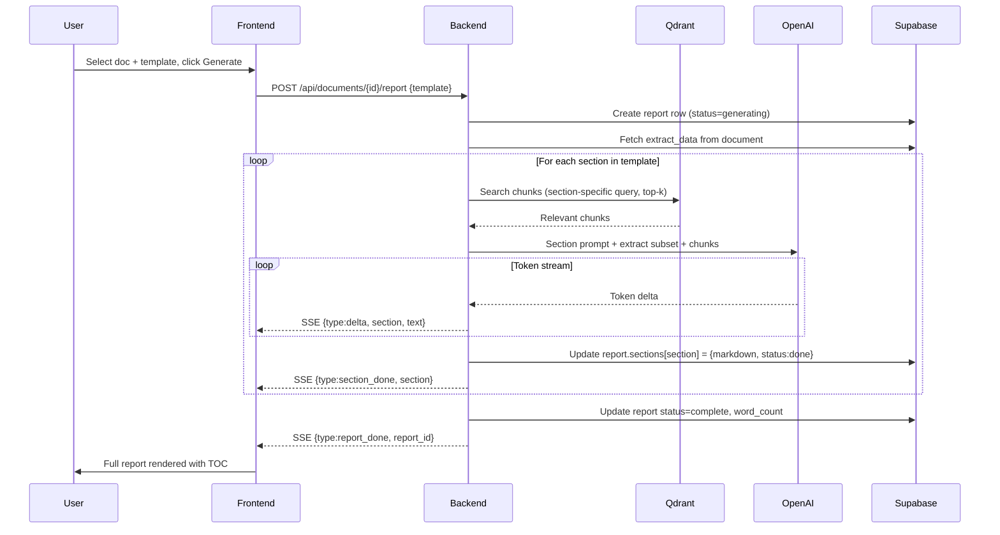
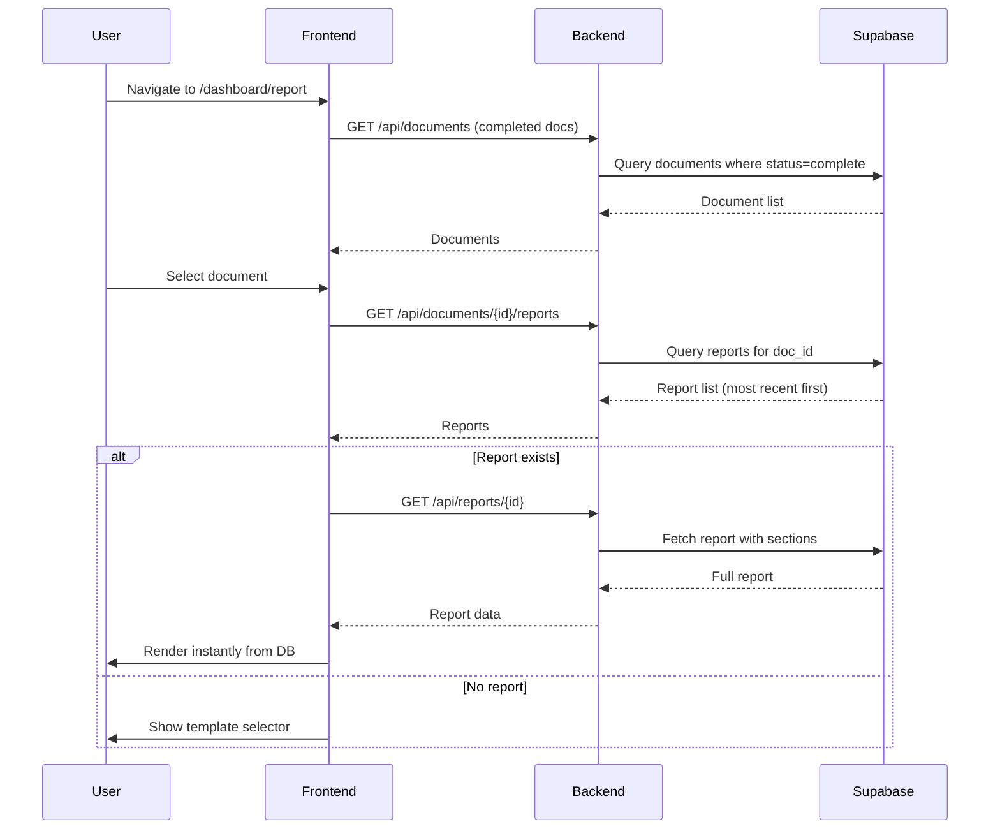
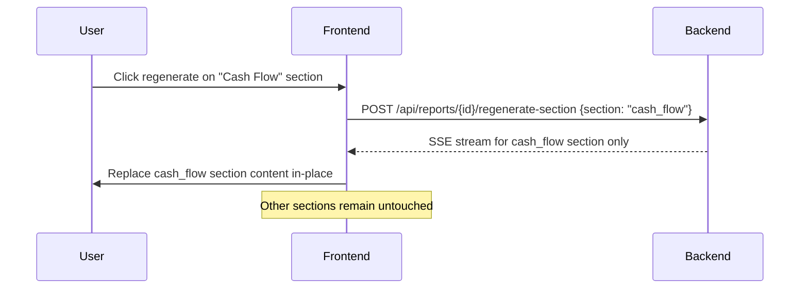

# AlphaLens V2 — Report Section Redesign

> **Author:** AI Lead Architect
> **Date:** 2026-03-25
> **Status:** Approved for implementation
> **Depends on:** Extract data pipeline (complete), Qdrant RAG (complete)

---

## 1. Executive Summary

The current Report section is a basic "generate markdown blob" that calls GPT-4o once with a single prompt, streams raw markdown, and offers .txt download. This does not meet fintech product standards.

This document redesigns the Report section as a **professional, multi-section financial report generator** with:

- **Section-by-section generation** — each section is a separate LLM call with specialized prompts, better quality, and section-level progress/retry
- **Report persistence** — generated reports saved to DB, viewable on return
- **Professional PDF export** — proper formatted PDF with cover page, headers, page numbers, charts
- **Template system** — multiple report types (Full Analysis, Executive Brief, Risk Report, Investor Memo)
- **Section-level regeneration** — regenerate one section without redoing the whole report
- **Report history** — view, compare, and manage past reports per document
- **Modern UI** — sidebar TOC, section progress indicators, skeleton loading, print-quality layout

### What we're NOT building (out of scope)
- Multi-document comparative reports (Phase 2)
- Scheduled/automated report generation
- Collaborative editing/annotation
- Custom template builder UI

---

## 2. Current Pain Points

| # | Problem | Impact |
|---|---------|--------|
| 1 | **Single LLM call** — one prompt generates all 7 sections at once | Quality degrades on long outputs; can't retry one section; GPT-3.5 would produce garbage at this length |
| 2 | **No persistence** — report lost on page refresh or navigation | Users must regenerate every time; waste of API costs and time |
| 3 | **max_tokens: 2048** — far too low for a full financial report | Report gets cut off; sections are thin and surface-level |
| 4 | **Export is .txt** — no PDF, no formatting preserved | Unprofessional; fintech users need PDF for sharing, compliance, archival |
| 5 | **Print uses `<pre>` tags** — raw markdown text in print window | Tables, formatting, headers all lost in print output |
| 6 | **No section navigation** — user must scroll through entire report | No TOC, no jump-to-section, no progress visibility during generation |
| 7 | **No report types** — one template for all documents | Annual report and earnings call get identical treatment |
| 8 | **Document sidebar is 280px** — wastes horizontal space | Report text is squeezed; financial tables often overflow |
| 9 | **No report history** — can't view previous generations | No comparison, no version tracking |
| 10 | **No section-level error handling** — if one section fails, entire generation shows generic error | User can't tell what failed or retry specifically |

---

## 3. Target UX — Report Section

### 3.1 Layout Architecture

```
┌──────────────────────────────────────────────────────────────┐
│  Header (existing — 57px)                                     │
├──────┬───────────────────────────────────────────────────────┤
│      │  Report Toolbar                                        │
│  DOC │  [Template ▾] [Filename] [Status]  [Export ▾] [Regen] │
│ LIST ├───────────────────────────────────────────────────────┤
│      │                                                        │
│ 240px│  ┌─────────┬──────────────────────────────────────┐   │
│      │  │ Section  │                                      │   │
│      │  │   TOC    │     Report Content                   │   │
│      │  │         │     (max-width: 780px, centered)     │   │
│      │  │ ○ Exec  │                                      │   │
│      │  │ ● Perf  │     ## Executive Summary              │   │
│      │  │ ○ BS    │     Revenue grew 12.3% YoY...        │   │
│      │  │ ○ CF    │                                      │   │
│      │  │ ○ Ratio │     ## Financial Performance          │   │
│      │  │ ○ Risk  │     | Metric | FY2024 | FY2023 |     │   │
│      │  │ ○ Conc  │     ...                              │   │
│      │  │         │                                      │   │
│      │  │ 180px   │                                      │   │
│      │  └─────────┴──────────────────────────────────────┘   │
│      │                                                        │
├──────┴───────────────────────────────────────────────────────┤
```

### 3.2 Report Templates

| Template | Sections | Target Length | Use Case |
|----------|----------|---------------|----------|
| **Full Analysis** (default) | 7 sections | ~3000 words | Deep dive for analysts |
| **Executive Brief** | 3 sections (Summary, Key Metrics, Conclusion) | ~800 words | Quick overview for stakeholders |
| **Risk Report** | 4 sections (Summary, Red Flags, Liquidity Analysis, Risk Conclusion) | ~1500 words | Compliance/risk teams |
| **Investor Memo** | 5 sections (Summary, Performance, Growth Drivers, Risks, Outlook) | ~2000 words | Investment committee |

### 3.3 UX States

**State 1: No document selected**
- Centered empty state with illustration
- "Select a document to generate a report"

**State 2: Document selected, no report exists**
- Template selector (4 cards with description)
- "Generate Report" CTA
- Shows document summary (company, fiscal year, type) from extract_data

**State 3: Report generating (section-by-section)**
- Section TOC on left shows progress:
  - `○` = pending (gray)
  - `◉` = generating (green pulse animation)
  - `●` = complete (green solid)
  - `✕` = error (red, clickable to retry)
- Completed sections render immediately — user can read while remaining sections generate
- Skeleton placeholders for pending sections
- Cancel button to abort remaining sections

**State 4: Report complete**
- Full report with TOC navigation
- Export dropdown: PDF, Copy Markdown, Print
- Regenerate (full) or per-section regenerate (hover on section header → regenerate icon)
- Report metadata bar: generated at, template type, word count, time taken

**State 5: Returning to existing report**
- Report loads from DB instantly (no regeneration)
- "Last generated: 2h ago" timestamp
- Option to regenerate fresh

**State 6: Error (full or partial)**
- If all sections fail: error state with retry button
- If some sections fail: completed sections shown, failed sections show inline error with retry

### 3.4 Section TOC Behavior

- Fixed position sidebar (180px width)
- Scrollspy: highlights current section as user scrolls
- Click to jump to section (smooth scroll)
- Shows generation status per section during streaming
- Collapses to icon-only on narrow viewports (<1200px)

### 3.5 Export: PDF

PDF export is the #1 user-facing improvement. Generated client-side using **@react-pdf/renderer**:

- **Cover page:** AlphaLens logo, company name, report type, fiscal period, generation date
- **Table of contents** with page numbers
- **Section headers** with accent color bars
- **Tables** with proper column widths, borders, alternating rows
- **Footer:** page number, "Generated by AlphaLens" watermark
- **Typography:** Inter font, 11pt body, 14pt headings

Why client-side: no server dependency, instant generation, works offline, no additional infrastructure.

---

## 4. Technical Architecture

### 4.1 Section-by-Section Generation

Instead of one large LLM call, each section gets its own specialized call:

```
POST /api/documents/{doc_id}/report
  Body: { template: "full_analysis" }
  Response: SSE stream

Events:
  { type: "section_start", section: "executive_summary", index: 0 }
  { type: "delta", section: "executive_summary", text: "..." }
  { type: "section_done", section: "executive_summary" }
  { type: "section_start", section: "financial_performance", index: 1 }
  { type: "delta", section: "financial_performance", text: "..." }
  ...
  { type: "report_done", report_id: "uuid" }
```

Each section call:
- Has its own **specialized system prompt** (e.g., "You are analyzing balance sheet liquidity...")
- Receives **only relevant extract_data fields** (e.g., balance sheet section only gets `extract.balance_sheet`)
- Gets **targeted RAG chunks** (query Qdrant with section-specific query, top-15 per section instead of 80 bulk)
- Has **appropriate max_tokens** per section (400-800 depending on template)
- Can **fail independently** without killing other sections

### 4.2 Backend: Section Prompts

```python
SECTION_CONFIGS = {
    "executive_summary": {
        "system": "You are a senior financial analyst writing a concise executive summary...",
        "extract_keys": ["company_name", "fiscal_year", "fiscal_period", "currency",
                         "income_statement", "key_metrics", "auditor_opinion", "red_flags"],
        "rag_query": "company overview financial highlights key metrics summary",
        "max_tokens": 600,
        "rag_top_k": 10,
    },
    "financial_performance": {
        "system": "You are analyzing income statement performance. Focus on revenue trends, "
                  "margin analysis, operating efficiency, and profitability...",
        "extract_keys": ["income_statement", "currency", "key_metrics"],
        "rag_query": "revenue profit income operating expenses margins growth",
        "max_tokens": 800,
        "rag_top_k": 15,
    },
    "balance_sheet_liquidity": {
        "system": "You are analyzing balance sheet health and liquidity position...",
        "extract_keys": ["balance_sheet", "currency", "key_metrics"],
        "rag_query": "assets liabilities equity debt cash liquidity solvency",
        "max_tokens": 700,
        "rag_top_k": 15,
    },
    "cash_flow": {
        "system": "You are analyzing cash flow patterns and capital allocation...",
        "extract_keys": ["cash_flow", "currency"],
        "rag_query": "operating cash flow investing financing capex free cash flow",
        "max_tokens": 600,
        "rag_top_k": 12,
    },
    "ratios_metrics": {
        "system": "You are presenting and interpreting key financial ratios...",
        "extract_keys": ["key_metrics", "income_statement", "balance_sheet"],
        "rag_query": "return on equity assets ratio margin efficiency",
        "max_tokens": 600,
        "rag_top_k": 10,
    },
    "red_flags_risks": {
        "system": "You are a risk analyst identifying concerns and red flags...",
        "extract_keys": ["red_flags", "auditor_opinion", "key_metrics", "balance_sheet"],
        "rag_query": "risk concern going concern debt leverage decline warning",
        "max_tokens": 600,
        "rag_top_k": 12,
    },
    "analyst_conclusion": {
        "system": "You are writing a balanced conclusion summarizing the financial position...",
        "extract_keys": None,  # receives all extract data
        "rag_query": "outlook summary conclusion recommendation",
        "max_tokens": 500,
        "rag_top_k": 8,
    },
}
```

### 4.3 Backend: Report Persistence

```sql
-- New table
CREATE TABLE reports (
  id         UUID PRIMARY KEY DEFAULT gen_random_uuid(),
  doc_id     UUID NOT NULL REFERENCES documents(id) ON DELETE CASCADE,
  user_id    UUID NOT NULL,
  template   TEXT NOT NULL DEFAULT 'full_analysis',
  sections   JSONB NOT NULL DEFAULT '{}',
  -- sections shape: { "executive_summary": { "markdown": "...", "status": "done", "generated_at": "..." }, ... }
  status     TEXT NOT NULL DEFAULT 'generating', -- generating | complete | partial | error
  word_count INT DEFAULT 0,
  created_at TIMESTAMPTZ DEFAULT now(),
  updated_at TIMESTAMPTZ DEFAULT now()
);

-- RLS policy
ALTER TABLE reports ENABLE ROW LEVEL SECURITY;
CREATE POLICY reports_user ON reports
  USING (user_id = auth.uid())
  WITH CHECK (user_id = auth.uid());

-- Index for fast lookup
CREATE INDEX idx_reports_doc ON reports(doc_id, user_id);
```

### 4.4 Backend: New/Modified Endpoints

```
POST   /api/documents/{doc_id}/report
         Body: { template: "full_analysis" }
         Returns: SSE stream (section-by-section)
         Side effect: creates report row, updates sections JSONB as each completes

GET    /api/documents/{doc_id}/reports
         Returns: list of reports for this doc (id, template, status, created_at, word_count)

GET    /api/reports/{report_id}
         Returns: full report with all sections

POST   /api/reports/{report_id}/regenerate-section
         Body: { section: "executive_summary" }
         Returns: SSE stream for that one section
         Side effect: updates the specific section in sections JSONB

DELETE /api/reports/{report_id}
         Deletes a report
```

### 4.5 Frontend: Component Structure

```
frontend/
  app/dashboard/report/
    page.tsx              ← Main report page (rewritten)
  components/report/
    ReportSidebar.tsx     ← Document list (240px, same as current but refined)
    TemplateSelector.tsx  ← 4 template cards for pre-generation state
    SectionTOC.tsx        ← Left TOC with scrollspy + generation status
    ReportViewer.tsx      ← Main content area, renders sections
    SectionCard.tsx       ← Individual section with header, content, regenerate btn
    ReportToolbar.tsx     ← Top bar: template badge, filename, export, regenerate
    ExportPDF.tsx         ← @react-pdf/renderer PDF document definition
    ReportMarkdown.tsx    ← Enhanced markdown renderer (extracted from page.tsx)
  lib/stores/
    report-store.ts       ← Zustand store for report session state
```

### 4.6 Frontend: State Management

```typescript
// report-store.ts
interface ReportStore {
  selectedDocId: string | null;
  activeReportId: string | null;
  template: ReportTemplate;
  sections: Record<string, SectionState>;
  generatingSection: string | null;

  setSelectedDoc: (docId: string | null) => void;
  setActiveReport: (reportId: string | null) => void;
  setTemplate: (t: ReportTemplate) => void;
  updateSection: (sectionId: string, state: Partial<SectionState>) => void;
}

interface SectionState {
  id: string;
  title: string;
  markdown: string;
  status: "pending" | "generating" | "done" | "error";
  error?: string;
  generatedAt?: string;
}

type ReportTemplate = "full_analysis" | "executive_brief" | "risk_report" | "investor_memo";
```

---

## 5. Data Flow Diagrams

### 5.1 Report Generation Flow



### 5.2 Report Load Flow (Returning User)



### 5.3 Section Regeneration Flow



---

## 6. LLM Strategy

### 6.1 Model Selection by Context

| Context | Current Model | Cost | Production Target |
|---------|--------------|------|-------------------|
| Report generation (gpt-4o) | gpt-4o | $$$$ | Keep — quality matters for reports |
| Section explanation (report_service.py) | gpt-3.5-turbo | $ | Upgrade to gpt-4o-mini when budget allows |
| **Development/testing** | **gpt-3.5-turbo** | $ | Use for iteration, switch to gpt-4o for prod |

### 6.2 Prompt Engineering Per Section

Each section prompt follows this structure:

```
SYSTEM:
  Identity: "You are a [role] at a financial analysis firm."
  Task: "[Specific section task]"
  Format: "Use markdown. ## for the section header. **bold** key figures.
           Use tables where comparing metrics. Use bullet points for lists."
  Constraints: "Base all analysis strictly on provided data. Do not invent figures.
                If data is missing, say so explicitly. Be precise with numbers."

USER:
  [Section-specific extract_data subset as JSON]
  [Section-specific RAG chunks (10-15)]
  [Explicit output instructions for this section]
```

### 6.3 Token Budget

| Template | Sections | Tokens/Section | Total Max Tokens | Est. Words |
|----------|----------|---------------|-----------------|------------|
| Full Analysis | 7 | 500-800 | ~4,500 | ~3,000 |
| Executive Brief | 3 | 400-600 | ~1,500 | ~800 |
| Risk Report | 4 | 500-700 | ~2,400 | ~1,500 |
| Investor Memo | 5 | 400-700 | ~2,800 | ~2,000 |

vs current: single call, max_tokens: 2048 for all 7 sections = ~300 tokens/section = thin.

---

## 7. PDF Export Architecture

### 7.1 Tech Stack

**@react-pdf/renderer** (client-side)
- Zero server dependency
- Uses same React component model
- Supports tables, images, page breaks, headers/footers
- ~180KB gzipped

### 7.2 PDF Structure

```
Page 1: Cover
  ┌────────────────────────────┐
  │                            │
  │     [AlphaLens Logo]       │
  │                            │
  │   FINANCIAL ANALYSIS       │
  │   REPORT                   │
  │                            │
  │   Company: Tesla Inc.      │
  │   Period: FY 2024          │
  │   Type: Full Analysis      │
  │                            │
  │   Generated: Mar 25, 2026  │
  │   By: AlphaLens AI         │
  │                            │
  └────────────────────────────┘

Page 2: Table of Contents
  1. Executive Summary .......... 3
  2. Financial Performance ...... 4
  3. Balance Sheet .............. 5
  ...

Pages 3+: Report Sections
  ┌────────────────────────────┐
  │ AlphaLens            p. 3  │  ← header
  ├────────────────────────────┤
  │                            │
  │ ## Executive Summary       │
  │                            │
  │ Tesla reported record...   │
  │                            │
  │ | Metric    | Value  |     │
  │ |-----------|--------|     │
  │ | Revenue   | $96.8B |     │
  │                            │
  ├────────────────────────────┤
  │ Generated by AlphaLens     │  ← footer
  └────────────────────────────┘
```

### 7.3 PDF Component Outline

```tsx
// ExportPDF.tsx
import { Document, Page, Text, View, StyleSheet } from "@react-pdf/renderer";

function ReportPDF({ report, doc }) {
  return (
    <Document>
      <CoverPage company={doc.company_name} period={doc.fiscal_year} template={report.template} />
      <TOCPage sections={report.sections} />
      {Object.entries(report.sections).map(([id, section]) => (
        <SectionPage key={id} section={section} />
      ))}
    </Document>
  );
}
```

---

## 8. UI/UX Detailed Specifications

### 8.1 Report Toolbar

```
┌──────────────────────────────────────────────────────────────┐
│ [Full Analysis ▾]  Tesla_10K_2024.pdf  ● Complete            │
│                                                              │
│              Generated 2h ago · 2,847 words · 12s            │
│                                    [Export ▾] [Regenerate ▾] │
└──────────────────────────────────────────────────────────────┘

Export dropdown:          Regenerate dropdown:
  ┌──────────────┐         ┌───────────────────┐
  │ 📄 Export PDF │         │ ↻ Full Report      │
  │ 📋 Copy MD    │         │ ↻ Current Section  │
  │ 🖨 Print      │         └───────────────────┘
  └──────────────┘
```

### 8.2 Template Selector (Pre-generation)

Four cards in a 2x2 grid:

```
┌─────────────────────┐  ┌─────────────────────┐
│ Full Analysis       │  │ Executive Brief     │
│                     │  │                     │
│ 7 sections          │  │ 3 sections          │
│ ~3,000 words        │  │ ~800 words          │
│ Deep financial dive │  │ Quick stakeholder   │
│                     │  │ overview            │
│ [Generate]          │  │ [Generate]          │
└─────────────────────┘  └─────────────────────┘
┌─────────────────────┐  ┌─────────────────────┐
│ Risk Report         │  │ Investor Memo       │
│                     │  │                     │
│ 4 sections          │  │ 5 sections          │
│ ~1,500 words        │  │ ~2,000 words        │
│ Compliance & risk   │  │ Investment committee │
│ focused             │  │ format              │
│ [Generate]          │  │ [Generate]          │
└─────────────────────┘  └─────────────────────┘
```

### 8.3 Section TOC (During & After Generation)

```
┌─────────────────┐
│  SECTIONS       │
│                 │
│  ● Exec Summary │  ← green dot = done
│  ◉ Performance  │  ← pulsing = generating
│  ○ Balance Sheet│  ← gray = pending
│  ○ Cash Flow    │
│  ○ Key Ratios   │
│  ○ Red Flags    │
│  ○ Conclusion   │
│                 │
│  ─────────────  │
│  2,847 words    │
│  Generated 2h   │
└─────────────────┘
```

### 8.4 Section Card (Within Report)

```
┌──────────────────────────────────────────────────────────┐
│ ■ Executive Summary                             [↻]     │  ← accent bar + regenerate icon (hover)
├──────────────────────────────────────────────────────────┤
│                                                          │
│ Tesla, Inc. reported record full-year revenue of         │
│ **$96.8 billion** for FY 2024, representing a **12.3%** │
│ increase year-over-year...                               │
│                                                          │
│ | Metric         | FY 2024    | FY 2023    | Change  |  │
│ |----------------|------------|------------|---------|  │
│ | Revenue        | $96.8B     | $86.2B     | +12.3%  |  │
│ | Net Income     | $12.1B     | $10.8B     | +12.0%  |  │
│ | Operating Margin| 14.2%     | 13.8%      | +40bps  |  │
│                                                          │
│ Key highlights:                                          │
│ ▸ Revenue growth driven by Model Y and energy segment    │
│ ▸ Gross margin improved 80bps to 21.4%                   │
│                                                          │
└──────────────────────────────────────────────────────────┘
```

### 8.5 Skeleton During Generation

```
┌──────────────────────────────────────────────────────────┐
│ ■ Balance Sheet & Liquidity                     ◉       │
├──────────────────────────────────────────────────────────┤
│                                                          │
│ ████████████████████████████████████ ████████████        │
│ ██████████████ ████████████████████████████              │
│ ██████████████████████ ████████████████                  │
│                                                          │
│ ┌──────────────────────────────────────────────┐        │
│ │ █████████  ████████  ████████  ████████      │        │
│ │ █████████  ████████  ████████  ████████      │        │
│ │ █████████  ████████  ████████  ████████      │        │
│ └──────────────────────────────────────────────┘        │
│                                                          │
└──────────────────────────────────────────────────────────┘
```

---

## 9. Implementation Phases

### Phase A: Core Infrastructure (Backend + Frontend Shell)

**Scope:**
- Report persistence (Supabase table + RLS)
- Section-by-section SSE generation (backend)
- New frontend page layout with TOC + section cards
- Template selector UI
- ReportMarkdown extracted to standalone component

**Acceptance Criteria:**
- [ ] Reports table exists with RLS
- [ ] POST generates section-by-section with proper SSE events
- [ ] Frontend renders sections as they stream
- [ ] TOC shows section status (pending/generating/done/error)
- [ ] Completed report loads from DB on return visit
- [ ] Template selector renders 4 options (only "Full Analysis" functional)

**Backend changes:**
- New `report_templates.py` with SECTION_CONFIGS per template
- Rewrite `POST /api/documents/{doc_id}/report` for section loop
- Add `GET /api/documents/{doc_id}/reports`, `GET /api/reports/{id}`
- Add `DELETE /api/reports/{id}`

**Frontend changes:**
- Rewrite `report/page.tsx` with new layout
- Create `ReportSidebar.tsx`, `SectionTOC.tsx`, `ReportViewer.tsx`, `SectionCard.tsx`, `ReportToolbar.tsx`, `TemplateSelector.tsx`
- Extract `ReportMarkdown.tsx` from existing inline renderer
- Create `report-store.ts`

### Phase B: Export + Section Regeneration

**Scope:**
- PDF export via @react-pdf/renderer
- Copy markdown (existing, refined)
- Print (proper HTML, not pre tags)
- Section-level regeneration
- Regenerate dropdown (full vs current section)

**Acceptance Criteria:**
- [ ] PDF downloads with cover page, TOC, formatted sections, page numbers
- [ ] Print opens properly formatted HTML (not raw markdown)
- [ ] Click regenerate on section header → only that section re-streams
- [ ] Full regenerate creates new report row (preserves history)

**New dependency:** `@react-pdf/renderer`

### Phase C: Templates + History + Polish

**Scope:**
- Remaining 3 templates (Executive Brief, Risk Report, Investor Memo)
- Report history list per document
- Delete report
- Polish: scrollspy, animations, responsive layout
- Performance: stale-while-revalidate for report list

**Acceptance Criteria:**
- [ ] All 4 templates generate correctly with appropriate sections/length
- [ ] Report history dropdown shows past reports with timestamp
- [ ] Delete report works with confirmation
- [ ] Scrollspy highlights correct TOC item during scroll
- [ ] Layout responsive at 1024px+ (TOC collapses below 1200px)

---

## 10. Performance Optimization

### 10.1 Generation Speed

| Optimization | Impact |
|-------------|--------|
| Section-by-section generation | User sees first section in ~3s instead of waiting 15-20s for full report |
| Section-specific RAG (top-15) instead of bulk (80 chunks) | Faster Qdrant queries, less prompt padding, better relevance |
| Appropriate max_tokens per section | No wasted tokens, faster completion |

### 10.2 Frontend Performance

| Optimization | Impact |
|-------------|--------|
| Report loaded from DB (not regenerated) on return | Instant render, zero API cost |
| Markdown → React nodes cached in section state | No re-parsing on scroll/resize |
| Section TOC uses IntersectionObserver for scrollspy | No scroll event handlers, 60fps |
| PDF generation runs in Web Worker (Phase B) | UI thread not blocked |

### 10.3 API Performance

| Optimization | Impact |
|-------------|--------|
| Report list endpoint returns metadata only (no markdown) | Fast list render |
| Full report endpoint returns all sections in one response | Single round-trip |
| Sections JSONB updated incrementally (not full replace) | Less DB write overhead |

---

## 11. QA / Test Plan

### 11.1 Functional Tests

| Test | Description | Priority |
|------|-------------|----------|
| Generate full report | All 7 sections complete, no truncation | P0 |
| Report persists | Navigate away, return → report loads from DB | P0 |
| Section retry | Fail one section, retry → only that section regenerates | P0 |
| Template selection | Each template generates correct sections | P1 |
| Export PDF | PDF downloads with cover, TOC, all sections | P1 |
| Export copy | Copies clean markdown to clipboard | P1 |
| Print | Opens formatted HTML window, triggers print | P1 |
| Report history | Multiple reports per doc, most recent shown first | P2 |
| Delete report | Removes from DB, UI updates | P2 |
| Empty extract | Report handles missing income_statement, balance_sheet gracefully | P1 |
| Abort generation | Cancel mid-stream, completed sections preserved | P1 |

### 11.2 Performance Tests

| Metric | Target | How to Measure |
|--------|--------|----------------|
| Time to first section | < 4s | Performance.mark in SSE handler |
| Full report generation | < 25s (7 sections) | SSE done event timestamp |
| Report load from DB | < 500ms | Network waterfall |
| PDF generation | < 3s | Blob creation timestamp |
| Tab switch to Report | < 200ms | Route transition time |

### 11.3 Regression Tests

- [ ] Analyzer tabs still work (Parse/Extract/Chat)
- [ ] Document list shared correctly between Analyzer and Report
- [ ] FinBot unaffected
- [ ] Auth/RLS prevents cross-user report access
- [ ] Session persistence (Zustand) doesn't conflict between analyzer-store and report-store

---

## 12. Rollout Plan + Telemetry

### 12.1 Rollout

| Phase | Timeline | Gate |
|-------|----------|------|
| Phase A | Week 1-2 | Section generation works, reports persist |
| Phase B | Week 3 | PDF export works, section regeneration works |
| Phase C | Week 4 | All templates, history, polish |

### 12.2 Telemetry Metrics

| Metric | Event | Purpose |
|--------|-------|---------|
| `report.generate.started` | User clicks Generate | Adoption |
| `report.generate.section_done` | Each section completes (with timing) | Per-section latency |
| `report.generate.completed` | Full report done (with total time, template, word count) | E2E performance |
| `report.generate.error` | Section or full report error | Error rate |
| `report.generate.aborted` | User cancels mid-generation | Drop-off |
| `report.export.pdf` | PDF downloaded | Export adoption |
| `report.export.copy` | Markdown copied | Export adoption |
| `report.export.print` | Print triggered | Export adoption |
| `report.section.regenerate` | Single section regenerated | Feature usage |
| `report.load.from_db` | Existing report loaded (with latency) | Cache hit rate |
| `report.template.selected` | Template chosen (which one) | Template popularity |

### 12.3 Success Criteria

| KPI | Target | Baseline (current) |
|-----|--------|-------------------|
| Report generation completion rate | > 95% | Unknown (no persistence) |
| Time to first section rendered | < 4s | ~8-12s (nothing shown until done) |
| PDF export adoption | > 40% of generated reports | 0% (not available) |
| Return visit report load | < 500ms | N/A (always regenerated) |
| Section regeneration usage | > 10% of reports | 0% (not available) |

---

## 13. Risks + Mitigations

| Risk | Likelihood | Impact | Mitigation |
|------|-----------|--------|------------|
| GPT-3.5 produces low-quality sections | High | High | Use gpt-4o-mini minimum; section-specific prompts with strict formatting instructions; test extensively before launch |
| @react-pdf/renderer tables break with wide data | Medium | Medium | Set max column widths, truncate cell content, test with real financial tables |
| Section-by-section is slower total time (7 calls vs 1) | Medium | Low | Sections are sequential for coherence, but smaller prompts complete faster; user sees progress immediately so perceived speed is better |
| Report JSONB grows large | Low | Low | Reports are text; even 5000 words is ~25KB; JSONB handles this fine |
| PDF generation blocks UI thread | Medium | Medium | Phase B: move to Web Worker; fallback: show progress spinner |
| Rate limiting on OpenAI (7 calls per report) | Low | Medium | Add 200ms delay between sections; implement exponential backoff |

---

## 14. Migration from Current System

### What stays:
- SSE streaming approach (proven, works)
- AlphaLens design tokens / color system
- Document list sidebar concept
- Markdown rendering approach (enhanced, not replaced)

### What changes:
- Single LLM call → section-by-section calls
- No persistence → Supabase reports table
- .txt download → PDF export
- Raw print → formatted HTML print
- No templates → 4 template types
- No history → report list per document
- 280px sidebar → 240px sidebar + 180px TOC
- Inline markdown renderer → extracted ReportMarkdown component

### Breaking changes: None
- New report table, new endpoints, new components
- Old endpoint behavior replaced (POST /report), but same URL
- No data migration needed (reports were never persisted)
